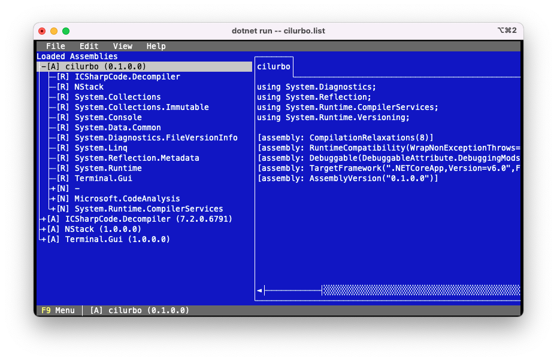

This is a proof-of-concept for implementing several ideas I have to investigate .net assemblies, largely around how good (or bad) IL linking is for applications. The basic parts, disassembler and decompiler, are useful by themselves for many other purposes.

As long as this remains a proof-of-concept (before 1.0) expect many breaking changes.

## Goals

* Complete: disassembler, decompiler, metadata tables...
* Keyboard driven
* Easy to build, extend and update (to latest [ICSharpCode.Decompiler](https://github.com/icsharpcode/ILSpy/tree/master/ICSharpCode.Decompiler) versions)
* Cross platform (at least macOS and Linux)

## Metadata codes

| Code| Name                    | Action [1]          |
|-----|-------------------------|---------------------| 
| [A] | Assembly                | Decompile (headers) |
| [b] | Base Type               | Goto                |
| [C] | Constructor (static)    | Decompile           |
| [c] | Constructor (instance)  | Decompile           |
| [E] | Event (static)          | Decompile           |
| [e] | Event (instance)        | Decompile           |
| [F] | Field (static)          | Decompile           |
| [f] | Field (instance)        | Decompile           |
| [i] | Interfaces (references) | Goto                |
| [M] | Method (static)         | Decompile           |
| [m] | Method (instance)       | Decompile           |
| [N] | Namespace               | Expand Tree         |
| [P] | Property (static)       | Decompile           |
| [p] | Property (instance)     | Decompile           |
| [R] | Assembly Reference      | Load + Goto         |
| [r] | Module Reference        | -                   |
| [T] | Type                    | Decompile + Expand  |

[1] `ENTER` or a mouse double click

## Shortcuts

| Shortcut | Description            |
|----------|------------------------| 
| F2       | Disassembler View (IL) |
| F3       | Decompiler View (C#)   |
| F4       | Metadata Tables        |
| F5       | Preferences            |
| F9       | Show menu              |
| ENTER    | Active selection       |

## TODO

* Add missing metadata tables
* Add decompiler options / preferences
* Add analysis tools
* Add resources
